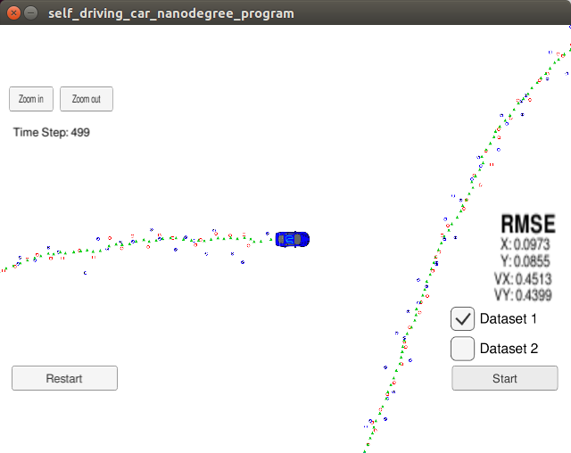
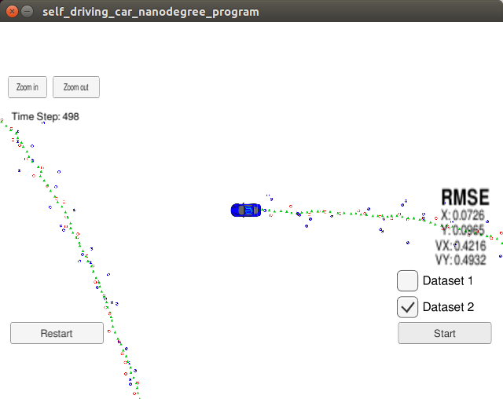

# Extended Kalman Filter
This Project is the sixth task (Project 1 of Term 2) of the Udacity Self-Driving Car Nanodegree program. 

The main goal of the project is to apply Extended Kalman Filter to fuse data from LIDAR and Radar sensors of a self driving car using C++.

The project was created with the Udacity [Starter Code](https://github.com/udacity/CarND-Extended-Kalman-Filter-Project).

## Content of this repo
- `scr` a directory with the project code:
  - `main.cpp` - reads in data, calls a function to run the Kalman filter, calls a function to calculate RMSE
  - `FusionEKF.cpp` - initializes the filter, calls the predict function, calls the update function
  - `kalman_filter.cpp`- defines the predict function, the update function for lidar, and the update function for radar
  - `tools.cpp` - a function to calculate RMSE and the Jacobian matrix
- `data`  a directory with two input files, provided by Udacity
- `Docs` a directory with files formats description
- [README_old.md](README_old.md) the task of the project by Udacity


## Result



Accuracy - RMSE: [0.09, 0.08,  0.45,  0.43]

*Threshold*: RMSE <= [0.11, 0.11, 0.52, 0.52]



Accuracy - RMSE: [0.07, 0.09, 0.42, 0.49]

*Threshold*: RMSE <= [0.11, 0.11, 0.52, 0.52]


## How to run the code
Clone this repo and perform 
```
mkdir build && cd build
cmake ..
sudo make
./ExtendedKF 
```
For details, see [README_old.md](README_old.md)

## PS
1. I use the angle normalization to keep the y[1](known as phi error) in the scale of (-pi,pi).

2. I modified the kalman_filter.h and add function "void KF(const Eigen::VectorXd &y)" to make the radar and lidar update function use the same KF step.


